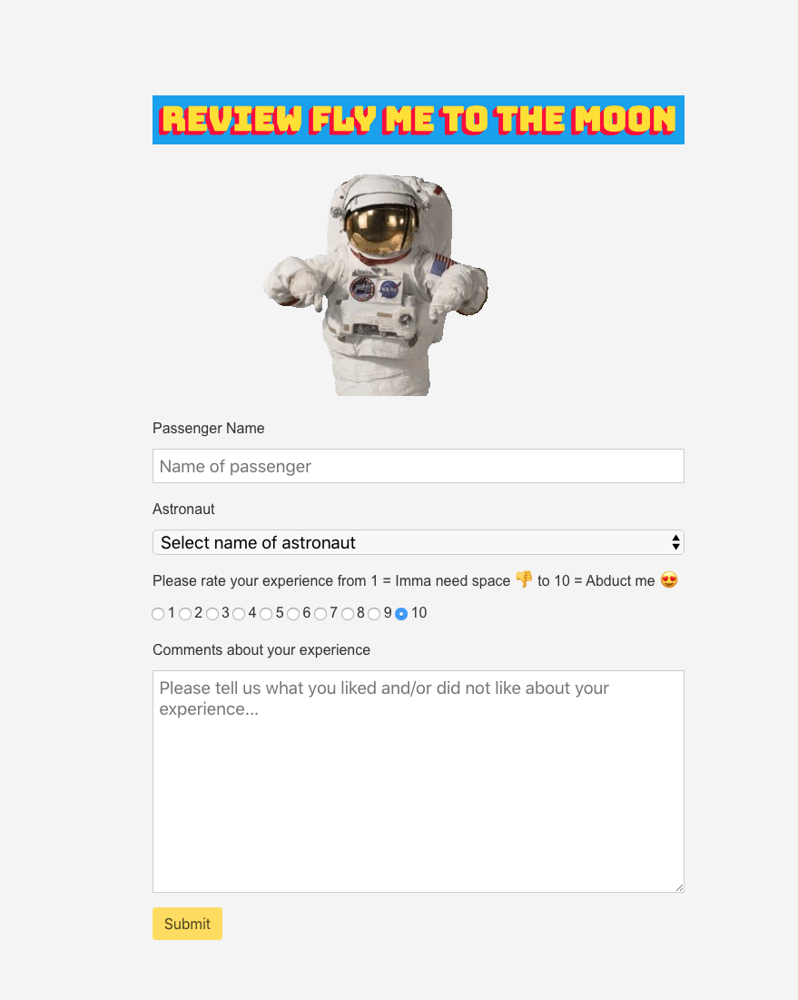

# Final Project: Fly Me to The Moon 🚀

Web Programming with Python and JavaScript

<h4 align="center">
  
</h4>

***Responsive Feedback Web App made with Flask and Python whereby passengers can leave a review about their trip to the moon and 
Fly Me To The Moon receives an email with the feedback and the data is also sent to Postgres database.***

---

## Final Project: Fly Me to the Moon Feedback Web App 

*Objectives*

> Opportunity to design and implement a dynamic website of my own.
> The nature of the application is subject to a few requirements:
> it must utilize at least two of Python, JavaScript, and SQL and it must be mobile-responsive.

Here's what I used:

- [`Python`](https://www.python.org/)
- [`Flask`](https://palletsprojects.com/p/flask/)
- [`JavaScript`](https://www.javascript.com/)
- [`PostgreSQL`](https://www.postgresql.org/)
- [`Adminer`](https://www.adminer.cs50.net)
- [`Heroku`](http://www.heroku.com/)
- [`Mailtrap`](https://mailtrap.io/)
- [`Bulma SCSS Framework`](https://bulma.io/)

 

## Usage

Clone repo

    $ git clone

Create a virtualenv (optional)

    $ python3 -m venv myvirtualenv

Install all dependencies

    $ pip install -r requirements.txt

Run Project

    $ python app.py runserver 

You can see it here:

    $ http://127.0.0.1:8000/

## File Structure
- templates = HTML pages rendered by the app
- static = Bulma CSS framework and JS  
- static/assets = Images used by app
- app.py = configure routes
- send_mail.py = send owner reviews via email 

## Acknowledgements

06.10.19 Submission for [`Harvard CS50W`](https://www.harvard.com)!